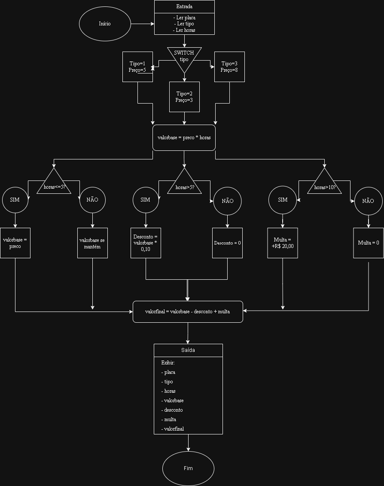

# atividade-estacionamentoEC
# Gerenciamento de Estacionamento Rotativo

**Nome:** Eduarda Sousa Coêlho\
**Matrícula:** 20240005582

## Análise do Problema (MODELAGEM)
Funcionamento:
- O cliente chega
- Informa a placa do veículo
- Operador ou sistema registra o tipo do veículo (carro, moto, caminhonete)
- O tempo que o veículo ficou estacionado é registrado (em horas)
- O preço vai depender do tipo de veículo e do tempo
Regras:
- Valor mínimo: mesmo ficando < 1h, cobra-se 1h
- Desconto: ficando > 5h
- Multa adicional: ficando > 10h
- No final o valor total é mostrado com os detalhes
Decisões:
- Qual o tipo de veículo?
- O tempo é <= 1h, entre 1h e 5h, entre 5h e 10h ou > 10h?
- Aplica desconto?  (sim ou não) aplica multa? (sim ou não)
- Cálculo do valor base, depois desconto e multa (se necessário)

## Definição das Variáveis (MODELAGEM)
(*Finalidade, Tipo, Nome*)
- Placas dos veículos → char[8] → placa
- Código para o tipo de veículo → int → tipo
- Tempo de permanência (horas) → float → horas
- Valor SEM desconto → float → valorbase
- % do desconto (se tiver) → float → desconto
- Valor da multa (se tiver) → float → multa
- Valor final → float → valorfinal
- Preço por hora → float → precohora

## Regras do Negócio (MODELAGEM)
Tabela de Preços:\
  Carro  |   Moto   | Caminhonete\
R$5,00/h | R$3,00/h | R$8,00/h

Regras Adicionais:
- Se <= 1h → cobra valor mínimo
- Se > 5h → desconta 10% sobre o valor total, antes da multa
- Se > 10h → multa adicional de R$20,00, depois do desconto

## Explicação da Lógica (FLUXOGRAMA)

1. Entrada: ler placa, ler tipos, ler horas
2. Processamento: switch (tipo) → escolher preço/h\
   2.1 tipo==1 → preço=5\
   2.2 tipo==2 → preço=3\
   2.3 tipo==3 → preço=8
3. Processamento: calcular → valorbase = horas*preço
4. Processamento: decisão (if) → horas <= 1? sim ou não → valorbase é o mesmo
5. Processamento: decisão (if) → horas > 5? se sim → calcular desconto = valorbase*0,10, se não → desconto = 0
6. Processamento: decisão (if) → horas > 10? se sim → + R$20,00, se não → multa = 0
7. Processamento: cálculo final → valorfinal = valorbase - desconto + multa
8. Saída: exibir placa, tipo, horas, valorbase, desconto, multa, valorfinal

## Implementação em C

#include <stdio.h>

  //Declaração de variáveis\
  //Float para números decimais\
int main() {\
  char placa[8]; //tem 7 caracteres + 1 para o terminador nulo 0 = 8 posições\
  int tipo;\
  float horas;\
  float valorbase, desconto, multa, valorfinal;\
  float precohora;
  
  //Entradas\
  printf("SISTEMA DE ESTACIONAMENTO ROTATIVO\n");\
  printf("Regras:\n");\
  printf("-Carro: R$5,00 por hora\n");\
  printf("-Moto: R$3,00 por hora\n");\
  printf("-Caminhonete: R$8,00 por hora\n");\
  printf("Até 5 hora: cobrado valor mínimo de 5 hora\n");\
  printf("Acima de 5 horas: 10%% de desconto\n");\
  printf("Acima de 10 horas: multa adicional de R$ 20,00\n");
  
  printf("Digite sua placa: ");\
  scanf("%s", placa); //ler a string corretamente\
  printf("Qual o tipo (1→Carro, 2→Moto, 3→Caminhonete)? ");\
  scanf("%d", &tipo);\
  printf("Tempo de permanência: ");\
  scanf("%f", &horas);

//Switch baseado no tipo\
switch(tipo) { //escolha do preço por hora\
  case 1: precohora = 5.0; break; //sair do switch\
  case 2: precohora = 3.0; break;\
  case 3: precohora = 8.0; break;\
  default: printf("Tipo inválido!\n");\
    return 1; //para indicar e encerrar com erro\
}\
if (horas <= 1.0) {\
   valorbase = precohora;\
}\
if (horas > 1.0) {\
   valorbase = horas * precohora;\
}\
if (horas > 5.0) {\
   desconto = valorbase * 0.10;\
} else {\
   desconto = 0.0;\
}\
if (horas > 10.0) {\
   multa = 20.0;\
} else { \
   multa = 0.0;\
}\
  valorfinal = valorbase - desconto + multa;

printf("\nDados do estacionamento\n");\
printf("Placa do veiculo: %s\n", placa);\
printf("Tipo do veiculo: ");

//De acordo com o número o tipo de veículo aparece\
if (tipo == 1) {\
  printf("Carro\n");\
}\
if (tipo == 2) {\
  printf("Moto\n");\
}\
if (tipo == 3) {\
  printf("Caminhonete\n");\
}\
//Saídas\
//Exibições com 2 casas decimais\
printf("Tempo de permanencia: %.2f horas\n", horas);\
printf("Valor base (SEM descontos/multas): (%.1f horas x R$ %.2f) = R$ %.2f\n", horas, precohora, valorbase);\
printf("Desconto aplicado de 10%: - R$ %.2f\n", desconto);\
printf("Valor da multa aplicada: + R$ %.2f\n", multa);\
printf("Valor final a pagar: R$ %.2f\n", valorfinal); 

return 0;\
}

## Como compilar e executar
Pré-requisito:
- Ter o compilador GCC instalado (no Linux já vem; no Windows, instalar MinGW)\
Passos:
1. Salve o arquivo `main.c` em uma pasta
2. Abra o terminal nessa pasta:
   - Windows: Shift + botão direito → "Abrir PowerShell/CMD aqui"
   - Linux/Mac: cd /caminho/da/pasta
3. Compile o programa:\
gcc main.c -o estacionamento
4. Execute o programa:\
./estacionamento (Linux/Mac) ou estacionamento.exe (Windows)
5. Digite os dados solicitados (placa, tipo, horas) e veja o resultado.

## Exemplo Prático
*Entrada*\
Placa: BRA2E19\
Tipo: 1\
Horas: 12

*Saídas*\
Dados do estacionamento\
Placa do veiculo: BRA2E19\
Tipo do veiculo: Carro\
Tempo de permanencia: 12.00 horas\
Valor base (SEM descontos/multas): (12.0 horas x R$5.00) = R$ 60.00\
Desconto aplicado de 10%: - R$ 6.00\
Valor da multa aplicada: + R$ 20.00\
Valor final a pagar: R$ 74.00

